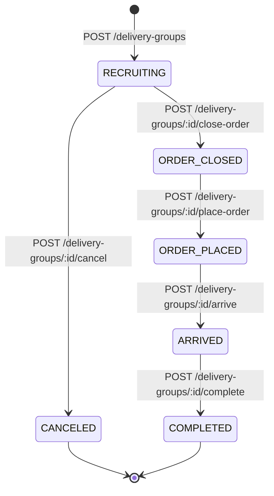

# YarrG API

YarrG API는 캠퍼스 공동 배달 주문을 위한 NestJS 백엔드입니다. 사용자는 Gistory IdP로 로그인하고, 배달 그룹을 만들거나 참여하고, 메뉴 요청을 등록한 뒤 주문과 정산을 진행합니다.

## 기술 스택

- NestJS
- Bun
- PostgreSQL
- Prisma
- Swagger/OpenAPI
- Gistory OAuth + JWT

## 핵심 도메인

- Delivery Group은 하나의 공동 배달 주문 그룹입니다.
- Organizer는 Delivery Group을 만든 사용자입니다.
- Organizer도 Participant입니다.
- Participant는 특정 Delivery Group 안에서 하나의 IdP 사용자를 나타냅니다.
- Participant는 모집 중일 때 자신의 Menu Request 목록을 통째로 교체할 수 있습니다.
- Recruitment Deadline이 지나면 참여, 탈퇴, 메뉴 변경이 막히지만 상태가 자동으로 바뀌지는 않습니다.
- Delivery Group 상태는 보통 `RECRUITING`, `ORDER_CLOSED`, `ORDER_PLACED`, `ARRIVED`, `COMPLETED` 순서로 진행됩니다.
- Delivery Group은 `RECRUITING` 상태에서만 `CANCELED`가 될 수 있습니다.
- Settlement는 Organizer가 실제 주문을 완료 처리할 때 생성됩니다.
- Payment Confirmation은 Organizer만 변경할 수 있습니다.

## 로컬 실행

의존성 설치:

```bash
bun install
```

로컬 PostgreSQL 실행:

```bash
docker compose up -d
```

`.env.example`을 참고해서 `.env`를 작성합니다.

Prisma Client 생성 및 마이그레이션:

```bash
bunx prisma generate
bunx prisma migrate dev
```

개발 서버 실행:

```bash
bun run start:dev
```

Swagger UI:

```text
http://localhost:3000/api
```

Prisma Studio:

```bash
bun run prisma:studio
```

## 환경 변수

```env
DATABASE_URL=

NODE_ENV=development
CORS_ORIGIN=

JWT_ACCESS_SECRET=
JWT_ACCESS_EXPIRES_IN=1h

GISTORY_CLIENT_ID=
GISTORY_CLIENT_SECRET=

GISTORY_AUTHORIZE_URL=https://idp.gistory.me/authorize
GISTORY_TOKEN_URL=https://api.idp.gistory.me/oauth/token
GISTORY_USERINFO_URL=https://api.idp.gistory.me/oauth/userinfo

GISTORY_REDIRECT_URI=http://localhost:3000/auth/gistory/callback
GISTORY_SCOPES=profile email
GISTORY_CODE_CHALLENGE=
```

`JWT_ACCESS_SECRET`은 충분히 긴 랜덤 문자열을 사용합니다.

```bash
openssl rand -base64 32
```

## 인증 흐름

Gistory 로그인 시작:

```text
GET /auth/gistory
```

Gistory callback:

```text
GET /auth/gistory/callback?code=...
```

서버는 authorization code를 Gistory token으로 교환하고, Gistory userinfo를 조회한 뒤 YarrG access token을 발급합니다.

보호된 API에는 YarrG access token을 bearer token으로 전달합니다.

```bash
curl http://localhost:3000/auth/me \
  -H "Authorization: Bearer ACCESS_TOKEN"
```

## 주요 API

Auth:

- `GET /auth/gistory`
- `GET /auth/gistory/callback`
- `GET /auth/me`

Delivery Groups:

- `POST /delivery-groups`
- `GET /delivery-groups`
- `GET /delivery-groups/:id`
- `POST /delivery-groups/:id/cancel`
- `POST /delivery-groups/:id/participants`
- `DELETE /delivery-groups/:id/participants/me`
- `PUT /delivery-groups/:id/my-menu-requests`
- `POST /delivery-groups/:id/close-order`
- `POST /delivery-groups/:id/place-order`
- `POST /delivery-groups/:id/arrive`
- `POST /delivery-groups/:id/complete`
- `GET /delivery-groups/:id/settlement`

Settlement Items:

- `PATCH /settlement-items/:id/payment-confirmation`

## 프론트엔드 화면별 API 사용 방식

별도 표기가 없는 API는 모두 YarrG access token을 bearer token으로 전달합니다.

```http
Authorization: Bearer ACCESS_TOKEN
```

### 로그인 화면

Gistory 로그인을 시작할 때 사용합니다.

```text
GET /auth/gistory
```

현재 구현은 Gistory callback을 백엔드가 처리하고 다음 형태의 응답을 반환합니다.

```json
{
  "accessToken": "..."
}
```

프론트엔드는 이 access token을 이후 보호 API 요청에 사용합니다.

### 내 정보 확인

앱 초기 진입 또는 새로고침 후 현재 token이 유효한지 확인할 때 사용합니다.

```text
GET /auth/me
```

응답:

```json
{
  "userId": "f1234567-89ab-cdef-0123-456789abcdef",
  "displayName": "홍길동"
}
```

### 배달 그룹 목록 화면

전체 배달 그룹 목록을 조회합니다.

```text
GET /delivery-groups
```

필터가 필요하면 query를 사용합니다.

```text
GET /delivery-groups?status=RECRUITING
GET /delivery-groups?mine=true
```

프론트에서는 이 응답으로 목록 카드, 현재 상태, 참여자 수, 모집 마감 시간을 표시합니다.

### 배달 그룹 생성 화면

새 배달 그룹을 생성합니다. 생성자는 자동으로 Participant가 됩니다.

```text
POST /delivery-groups
```

요청 예시:

```json
{
  "title": "같이 야식 시키실 분들 찾아요..",
  "storeName": "기영이 숯불두마리치킨 광주첨단점",
  "pickupPlace": "신관 1층 로비",
  "recruitmentDeadline": "2026-05-25T10:00:00.000Z",
  "maxParticipants": 4
}
```

### 배달 그룹 상세 화면

상세 화면 진입 시 그룹, 참여자, 메뉴 요청, 정산 생성 여부를 조회합니다.

```text
GET /delivery-groups/:id
```

이 화면에서 상태에 따라 다음 액션을 노출합니다.

- `RECRUITING`: 참여, 나가기, 메뉴 요청 수정, Organizer의 취소/주문 마감
- `ORDER_CLOSED`: Organizer의 실제 주문 완료 처리
- `ORDER_PLACED`: 도착 처리, 정산 조회
- `ARRIVED`: 완료 처리
- `COMPLETED`: 정산 확인
- `CANCELED`: 읽기 전용

### 참여 / 나가기

배달 그룹에 참여합니다.

```text
POST /delivery-groups/:id/participants
```

현재 사용자의 참여를 취소합니다.

```text
DELETE /delivery-groups/:id/participants/me
```

Organizer는 나갈 수 없습니다. 참여와 나가기는 `RECRUITING` 상태이고 모집 마감 전일 때만 가능합니다.

### 내 메뉴 요청 수정 화면

현재 사용자의 메뉴 요청 목록을 통째로 교체합니다.

```text
PUT /delivery-groups/:id/my-menu-requests
```

요청 예시:

```json
{
  "menuRequests": [
    {
      "menuName": "김치찌개",
      "optionText": "돼지고기 포함",
      "price": 8000,
      "quantity": 1,
      "note": "젓가락 주세요"
    }
  ]
}
```

빈 배열도 허용됩니다.

```json
{
  "menuRequests": []
}
```

단, 주문 마감 전에는 모든 Participant가 하나 이상의 메뉴 요청을 가지고 있어야 합니다.

### Organizer 관리 화면

모집을 마감합니다.

```text
POST /delivery-groups/:id/close-order
```

실제 주문 완료를 기록하고 정산을 생성합니다.

```text
POST /delivery-groups/:id/place-order
```

요청 예시:

```json
{
  "estimatedArrivalMinutes": 45,
  "deliveryFee": 3000
}
```

도착 상태로 전환합니다.

```text
POST /delivery-groups/:id/arrive
```

완료 상태로 전환합니다.

```text
POST /delivery-groups/:id/complete
```

모집 중인 배달 그룹을 취소합니다.

```text
POST /delivery-groups/:id/cancel
```

### 정산 화면

배달 그룹의 정산 정보를 조회합니다.

```text
GET /delivery-groups/:id/settlement
```

Organizer가 특정 참여자의 결제 여부를 확인하거나 취소합니다.

```text
PATCH /settlement-items/:id/payment-confirmation
```

요청 예시:

```json
{
  "isPaid": true
}
```

`isPaid`가 `true`이면 `paidAt`이 현재 시간으로 저장되고, `false`이면 `paidAt`이 `null`로 돌아갑니다.

## 상태 전이



상태별 주요 규칙:

- `RECRUITING`: 참여, 나가기, 메뉴 요청 변경이 가능합니다.
- `RECRUITING`: Organizer만 취소할 수 있습니다.
- `RECRUITING`: Recruitment Deadline 이후에는 참여, 나가기, 메뉴 요청 변경이 막힙니다.
- `ORDER_CLOSED`: 더 이상 메뉴 요청을 바꿀 수 없습니다.
- `ORDER_CLOSED`: Organizer가 실제 주문 완료를 기록하면 `ORDER_PLACED`가 되고 Settlement가 생성됩니다.
- `ORDER_PLACED`: Organizer가 도착 처리를 할 수 있습니다.
- `ARRIVED`: Organizer가 완료 처리를 할 수 있습니다.
- `COMPLETED`, `CANCELED`: 읽기 중심 상태입니다.

## 자주 쓰는 명령

```bash
bun run build
bun run start:dev
bun run start:prod
bun run prisma:generate
bun run prisma:migrate
bun run prisma:deploy
bun run prisma:studio
bun run lint
```

## 배포 메모

- 배포 환경의 `GISTORY_REDIRECT_URI`는 실제 public domain 기준 callback URL이어야 합니다.
- public callback URL에는 별도 포트를 붙이지 않습니다.
- 프론트엔드 배포 URL이 정해지면 `CORS_ORIGIN`을 설정해야 합니다.

## 주의사항

- `.env`는 커밋하지 않습니다.
- `DATABASE_URL`, `JWT_ACCESS_SECRET`, `GISTORY_CLIENT_SECRET`은 외부에 노출되면 안 됩니다.
